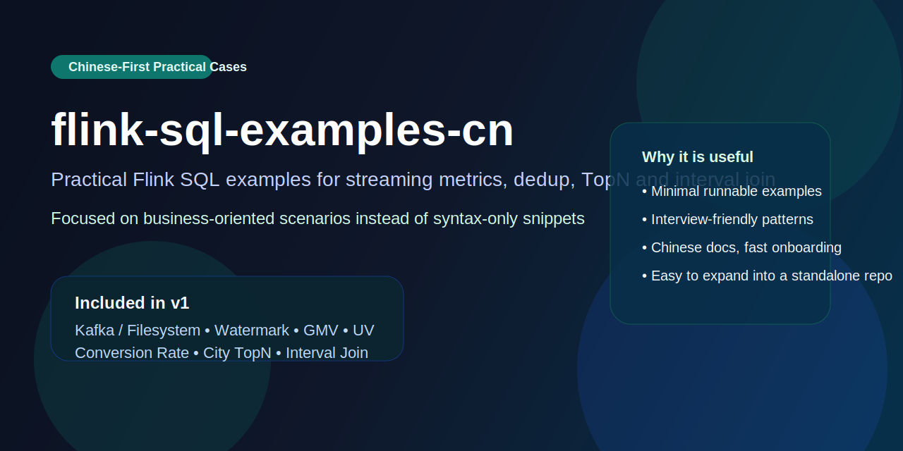
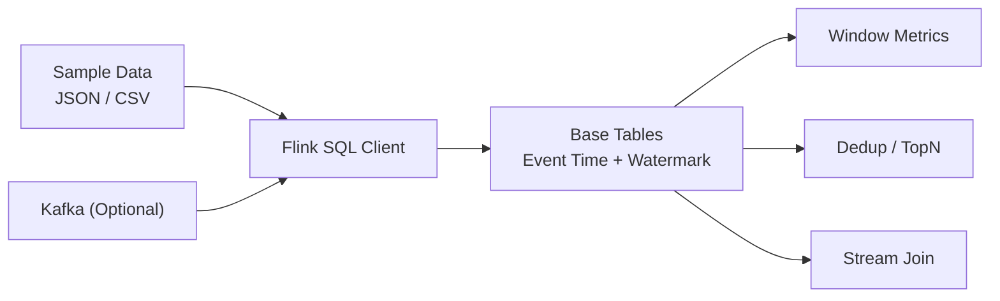

# flink-sql-examples-cn

中文 Flink SQL 实战案例库，面向数据开发、数仓工程师和实时计算工程师。

This repository is a lightweight, Chinese-first collection of practical Flink SQL examples.
It focuses on business-oriented streaming scenarios instead of syntax-only snippets.
The project is designed for learning, sharing, and fast local experimentation.




这个仓库的目标不是罗列语法，而是用尽量小的样例覆盖真实业务里最常见的 Flink SQL 场景，例如：

- Kafka / 文件源建表
- 事件时间与水位线
- 滚动窗口统计
- 去重与保留最新记录
- 从明细流到轻量指标流

## 30 秒看价值

如果你满足下面任意一种情况，这个仓库就值得直接收藏：

- 你会 SQL，但还没把 Flink SQL 用到真实业务里
- 你想准备实时数仓 / 流式开发相关面试
- 你想找一套能快速演示给同事看的最小案例
- 你想从 “看语法” 过渡到 “能写业务指标 SQL”

这个仓库的重点不是“大而全”，而是“能直接上手、能真实复用、能持续扩展”。

## 项目状态

- 当前状态：持续更新中的学习型案例库
- 主要定位：Flink SQL 入门到业务实战之间的桥梁
- 适合用途：自学、团队分享、面试准备、最小可运行演示
- 不承诺：覆盖所有 Flink SQL 语法、兼容所有版本、提供一对一环境排障

如果你在找“完整官方文档替代品”，这个仓库不适合；如果你在找“能快速上手并理解真实业务写法的案例库”，这个仓库适合。

## 发布资料

- 仓库封面图：[`assets/repo-cover.svg`](./assets/repo-cover.svg)
- 独立仓库发布建议：[`docs/repo-launch.md`](./docs/repo-launch.md)
- 独立初始化说明：[`docs/standalone-init.md`](./docs/standalone-init.md)
- 变更记录：[`CHANGELOG.md`](./CHANGELOG.md)

## 为什么做这个仓库

很多 Flink SQL 教程存在几个共同问题：

- 语法片段多，但很少给完整可跑的案例
- 只讲概念，不讲真实数仓/指标口径
- 英文资料多，中文案例少
- 缺少适合面试复习和日常查阅的目录化内容

这个仓库会尽量把每个案例写成下面这种结构：

1. 业务场景
2. 输入数据
3. 建表语句
4. 核心 SQL
5. 输出结果
6. 常见坑点

## 适合谁

- 想从离线数仓转实时计算的工程师
- 想补 Flink SQL 实战案例的初中级开发
- 需要面试准备、知识查漏补缺的大数据工程师
- 想做内部培训或分享材料的团队

## 你会在这里学到什么

- 如何定义带事件时间和水位线的源表
- 如何写常见窗口指标，例如 GMV、UV、转化率
- 如何做 `ROW_NUMBER()` 去重和 TopN
- 如何做订单流与支付流的时间区间 Join
- 如何把“演示 SQL”逐步扩成“业务 SQL”

## 最小体验架构



## 仓库结构

```text
flink-sql-examples-cn/
├── cases/
│   ├── 00_prepare_tables.sql
│   ├── 01_kafka_to_print.sql
│   ├── 02_tumble_gmv.sql
│   ├── 03_user_uv.sql
│   ├── 04_latest_order_per_user.sql
│   ├── 05_pay_conversion.sql
│   ├── 06_city_gmv_topn.sql
│   └── 07_order_payment_interval_join.sql
├── data/
│   ├── orders.jsonl
│   ├── order_created.jsonl
│   ├── payments.jsonl
│   └── user_profiles.csv
├── docs/
│   ├── case-map.md
│   └── publishing-checklist.md
├── connectors/
│   └── README.md
├── .gitignore
├── docker-compose.yml
└── LICENSE
```

## 当前案例

| 编号 | 文件 | 主题 | 场景 |
| --- | --- | --- | --- |
| 00 | `cases/00_prepare_tables.sql` | 基础建表 | 基于文件源定义订单明细表、维表和调试输出表 |
| 01 | `cases/01_kafka_to_print.sql` | 数据接入 | Kafka 订单流写入 Print Sink，快速验证链路 |
| 02 | `cases/02_tumble_gmv.sql` | 窗口聚合 | 统计 1 分钟窗口 GMV、订单数、支付用户数 |
| 03 | `cases/03_user_uv.sql` | 去重统计 | 统计分钟级下单 UV |
| 04 | `cases/04_latest_order_per_user.sql` | 明细去重 | 基于事件时间保留每个用户的最新一笔订单 |
| 05 | `cases/05_pay_conversion.sql` | 指标分析 | 统计分钟级下单转支付转化率 |
| 06 | `cases/06_city_gmv_topn.sql` | 维表关联 | 统计分钟级城市 GMV TopN |
| 07 | `cases/07_order_payment_interval_join.sql` | 双流 Join | 关联订单流和支付流，统计支付延迟 |

## 推荐先看这 3 个案例

### 1. 窗口 GMV

文件：[cases/02_tumble_gmv.sql](./cases/02_tumble_gmv.sql)

适合入门窗口聚合，也是实时指标最常见的起点。

### 2. 转化率

文件：[cases/05_pay_conversion.sql](./cases/05_pay_conversion.sql)

这是面试和业务里都高频出现的指标口径，比单纯聚合更接近真实分析场景。

### 3. 订单流与支付流 Join

文件：[cases/07_order_payment_interval_join.sql](./cases/07_order_payment_interval_join.sql)

这是从“会写 SQL”进入“理解流式业务链路”的关键一步。

## 快速开始

### 1. 启动本地环境

```bash
cd flink-sql-examples-cn
make up
```

启动后可访问：

- Flink Web UI: `http://localhost:8081`
- Kafka Broker: `localhost:9092`

### 2. 打开 SQL Client

```bash
make sql-client
```

### 3. 先执行基础建表

```sql
SOURCE '/workspace/cases/00_prepare_tables.sql';
```

### 4. 执行某个案例

```sql
SOURCE '/workspace/cases/02_tumble_gmv.sql';
```

如果你想快速感受更像业务指标的案例，建议顺序如下：

```sql
SOURCE '/workspace/cases/05_pay_conversion.sql';
SOURCE '/workspace/cases/06_city_gmv_topn.sql';
SOURCE '/workspace/cases/07_order_payment_interval_join.sql';
```

如果你不熟悉可用命令，可以先执行：

```bash
make help
```

## 如何提 Issue

提交 Issue 前，请先尽量准备这些信息：

- Flink 版本
- 运行方式，例如 `docker compose`、本地 SQL Client、集群环境
- 执行的 SQL 文件或最小复现 SQL
- 完整报错信息
- 复现步骤和你的预期结果

优先欢迎这两类 Issue：

- 仓库文档错误、步骤缺失、链接失效
- 高频业务场景案例建议，且能说明业务价值

不建议提交过于宽泛的问题，例如“Flink SQL 怎么学”“帮我看整个环境为什么起不来”。这类问题超出仓库轻维护范围。

详细规范见 [SUPPORT.md](./SUPPORT.md) 和 [`.github/ISSUE_TEMPLATE`](./.github/ISSUE_TEMPLATE)。

## 如何贡献案例

欢迎补充案例，但请尽量保持风格统一。

建议一个案例至少包含这些部分：

1. 场景
2. 输入表
3. 建表语句或依赖前置表
4. 核心 SQL
5. 输出结果或指标说明
6. 常见坑点

约定如下：

- 文件命名使用 `NN_topic_name.sql`
- 文件头部加固定注释，说明场景、输入表、核心知识点、适用版本
- 样例数据保持小而可读，不提交 connector jar、大文件或二进制附件

具体格式见 [docs/case-template.md](./docs/case-template.md) 和 [CONTRIBUTING.md](./CONTRIBUTING.md)。

## 数据说明

示例数据位于 `data/orders.jsonl`，字段如下：

| 字段 | 类型 | 说明 |
| --- | --- | --- |
| `order_id` | string | 订单 ID |
| `user_id` | string | 用户 ID |
| `amount` | decimal(10,2) | 订单金额 |
| `event_type` | string | 事件类型，例如 `create`、`pay` |
| `ts` | bigint | 毫秒时间戳 |

另外还提供了两份双流 Join 示例数据：

- `data/order_created.jsonl`
- `data/payments.jsonl`

## Kafka Connector 说明

为了让仓库保持轻量，这里没有直接提交第三方 connector jar。若要运行 Kafka 案例，请先按 [connectors/README.md](./connectors/README.md) 中的说明把 Kafka connector 放到 `connectors/` 目录。

如果你只想先体验 SQL 语法，可以先跑文件源相关案例。

## 路线图

- 补充 CDC 场景
- 补充维表 Join / Lookup Join 场景
- 补充 TopN 与热门指标场景
- 补充迟到数据与侧输出说明
- 补充 Doris / Paimon 下游落地模板
- 增加每个案例的结果截图

## 建议发布节奏

- 第一阶段：先发布 5 到 10 个最常用案例
- 第二阶段：每周补 1 到 2 个业务场景
- 第三阶段：同步写技术文章，把文章流量导回仓库

## 更新记录

详细更新见 [CHANGELOG.md](./CHANGELOG.md)。

## 贡献

欢迎提 Issue 或 PR，建议优先贡献以下内容：

- 常见业务场景案例
- 运行文档修正
- 兼容不同 Flink 版本的说明
- 示例数据和结果截图

## 维护原则

- 仓库按轻维护方式运行，欢迎 Issue 和 PR，但不保证实时响应
- 优先处理文档修正、案例补充、明确可复现的问题
- 不承诺做一对一环境排障、私有业务 SQL 改写或完整培训答疑
- 若未来拆分为独立仓库，现有目录和文档会尽量保持兼容迁移

## 独立仓库就绪状态

- 当前目录已包含独立仓库常见入口：`README`、`LICENSE`、`.github`、`Makefile`
- 当前目录不依赖当前大仓库根目录资源
- 如果要拆分成新仓库，可直接参考 [docs/standalone-init.md](./docs/standalone-init.md)

## Star 前你能预期什么

- 不承诺覆盖所有 Flink SQL 语法
- 会优先补“真实业务高频场景”
- 每个案例都会尽量保持可读、可复制、可改造
- 仓库更适合作为学习和分享起点，不是官方文档替代品

## License

MIT
